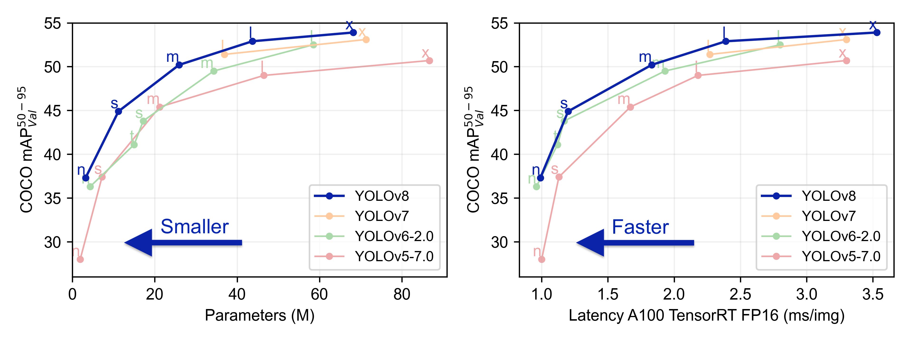
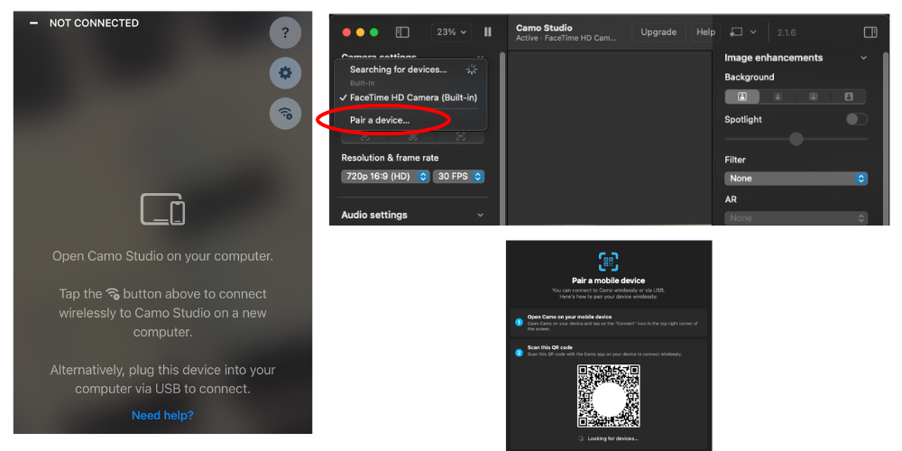
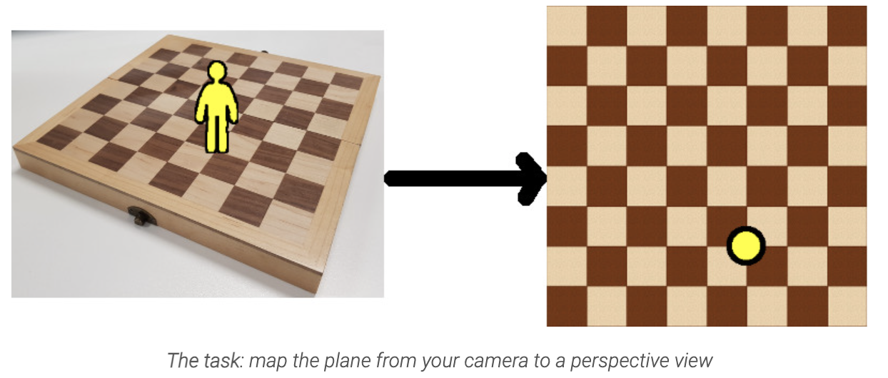
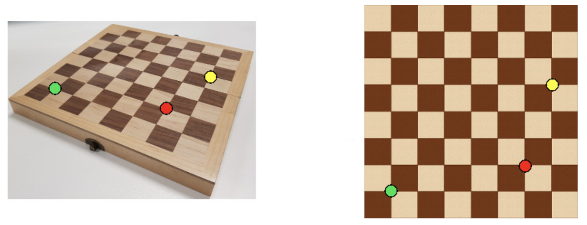
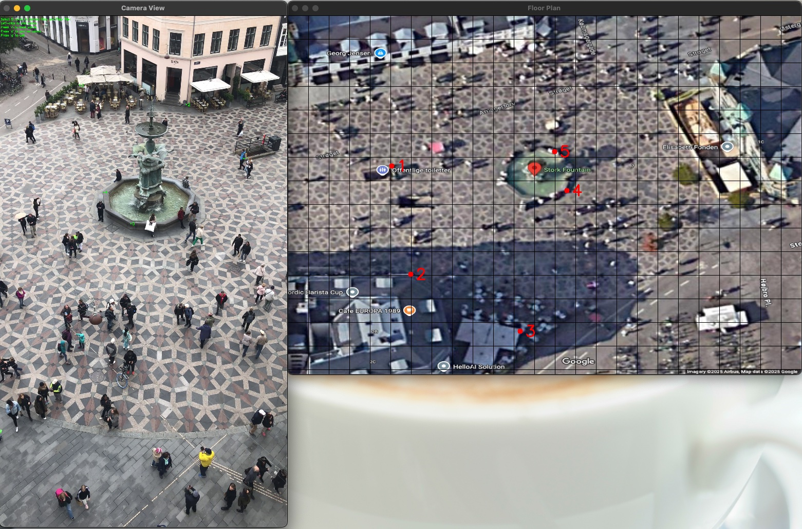
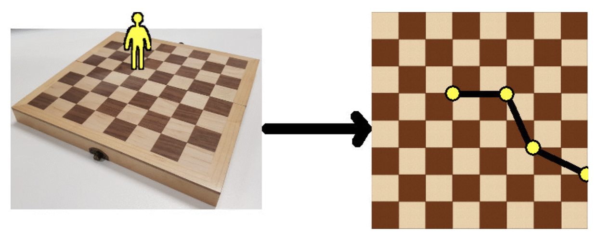
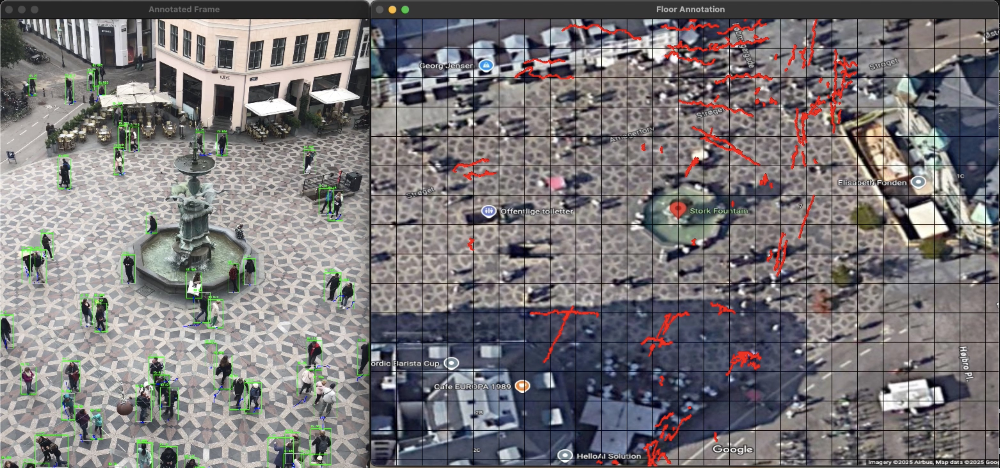

# Crowd Monitoring Overview 

The Project Orion aims to apply cutting-edge AI technology to enhance crowd monitoring at various levels. In this semester, we are building on previous efforts to develop an intelligent tracking system, moving from IoT approach to application approach. Our main goal is create a **cloud-based** computer vision pipeline for improved efficiency and faster processing. Later, the application can connect to a database platform and fetching real-time data.

## YOLOv8
Computer Vision (CV) is used in traffic anlysis, automation of manufacturing processed,and human monitoring, which is the essential aspect that we are focusing this semester.

**YOLOv8** is a state of the art to monitor and track people in real-time. By combine that with Supervision library, we can detect and track people. 


Source: https://docs.ultralytics.com/models/yolov8/

## Installation
**Prerequisites**
- NumPy
- Matplotlib
- Ultralytics
- OpenCV

**Steps**
1. **Clone the Repository:**
    ```bash
    git clone https://github.com/Redback-Operations/redback-orion
    ```
2. **Install Dependencies:**
    ```bash
    pip install -r requirements.txt
    ```
3. **Setup YOLOv8:**
    - Follow the [YOLOv8 installation guide](https://docs.ultralytics.com/models/yolov8/) to set up the detection model.

## Blue print
We are focusing to build a pipeline for real-time camera process. 

CCTV >> YOLOv8 >> MongoDB >> Website/Dashboard

## Initialize libraries
This tells you the versions of both PyTorch and CUDA that are installed for **Environment setup**:

```python
import torch
!nvcc --version
TORCH_VERSION = ".".join(torch.__version__.split(".")[:2])
CUDA_VERSION = torch.__version__.split("+")[-1]
print("torch: ", TORCH_VERSION, "; cuda: ", CUDA_VERSION)
```

We will use YOLOv8 in this project:
```python
!pip install ultralytics

from IPython import display
display.clear_output()

import ultralytics
ultralytics.checks()
```
Supervision library:
```python
!pip install supervision==0.2.0

from IPython import display
display.clear_output()

import supervision as sv
print("supervision", sv.__version__)
```
```python
import os
HOME = os.getcwd()
print(HOME)
```
## Crowd Monitoring
We will use video from Supervision assets - [PEOPLE_WALKING](https://media.roboflow.com/supervision/video-examples/people-walking.mp4)

 *After downloaded, please refer to [Entering & Exiting Humans](https://github.com/Redback-Operations/redback-orion/tree/704c9d6caadb4c8b217850e98f5ad22110f0e72f/Crowd_Monitoring/Entering%20and%20Exiting%20Humans) for video/mp4 testing.*

### Live Tracking
Testing Live Tracking with [this GitHub repository](https://github.com/Khanhvinh1999/redback-orion/tree/916082740654e155dab28f9fc2b0a313169b597f/Crowd_Monitoring/Live_Tracking) for Live Video testing.
## RTSP Camera
Please refer to [steps to set up RTSP Camera](https://github.com/Khanhvinh1999/redback-orion/blob/main/Crowd_Monitoring/Live_Tracking/README.md#retrieving-rtsp)

### Result


## Camo app - Virtue Camera 
We will need to download it on your mobile device and PC via App store/Google Play. After setup the app via QR code, we can now use our mobile device as a virtue camera for VS Code.


**Result** 

## Visualization
We will need to visualize data to display and analysis on dashboard. 

>The idea is fetching the tracking path from processed data, plotting their points from **camera footage** onto **2D floor plan**. 

From that, we can do **flow analysis** and **heatmap** to evaluate crowd density. 

This is a powerful information. It will allow you to easily recognize common pattern of congestion at particular times of day or places. Moreover, it can improve your business performance by arranging staffs and products, make inform decisions to drive sales. 

Your security camera images are distorted. For example, a one pixel movement at the top of your image corresponds to a much larger movement in the real world than a one pixel movement at the bottom of your image.

>Homography Transformation is the solution for camera mapping. 



Source: https://zbigatron.com/mapping-camera-coordinates-to-a-2d-floor-plan/

We need to calculate corresponse mapping matrix H for homography transformation. We can create the matrix by choosing pixel coordinates in camera view and corresponding pixel coordinates in matching image (at least 4 points).

### Coordinate Selector
For homography transformation, we use the `coordinateSelector.py` script available in the Crowd-Monitoring Backend_v2. This tool provides an interactive interface for selecting corresponding points between the camera view and floor plan, which are then used to calculate the homography matrix.

The Coordinate Selector tool features:
- Point-and-click interface for selecting corresponding points in both views
- Ability to select and adjust at least 4 points for accurate mapping
- Automatic calculation of the homography transformation matrix
- Preview of transformation results before finalizing
- Exports the transformation matrix for use in the tracking pipeline

This approach allows for precise mapping of camera coordinates to real-world floor plan coordinates, enabling accurate visualization of crowd movement patterns.


*Coordinate Selector Interface: Camera view (left) with corresponding floor plan (right), showing mapping points*

>Use matrix H to performed track points transformation to plot path on map 2D floor plane.




*Visualization Result: YOLOv8 detection with tracking paths (left) mapped to floor plan (right) using homography transformation*

### Multithreading for Performance Optimization

To enhance the performance of our crowd monitoring pipeline, we implement multithreading in the `cameraProcessing.py` module. This approach significantly improves processing speed by parallelizing different stages of the computer vision pipeline.

#### Why Three-Thread Architecture?

OpenCV's frame capture process (`cv2.VideoCapture().read()`) can be prone to several critical issues when used in a single-threaded application:

1. **Frame Dropping**: In a single-threaded approach, if the YOLO processing takes too long, OpenCV may drop frames or create a significant lag between capture and processing, resulting in outdated analysis.

2. **Buffer Overflow**: OpenCV maintains an internal buffer for captured frames. When processing is slow, this buffer can overflow, causing memory issues or freezing the application.

3. **Blocking Operations**: Frame capture operations can block the main thread, preventing UI updates or other critical operations from executing smoothly.

4. **Resource Contention**: When camera capture and heavy processing compete for the same CPU resources, both operations can suffer from degraded performance.

By dividing our pipeline into three separate threads (Capture, Process, and Handle), we effectively:

- **Isolate Buffer Management**: The capture thread continuously reads from the camera, preventing buffer overflow issues in OpenCV.
- **Stabilize Frame Rate**: Even when detection is computationally expensive, the capture thread maintains consistent frame acquisition.
- **Prevent Cascading Failures**: If one thread encounters an issue, the other threads can continue operating independently.
- **Enable Priority Management**: Critical operations like frame capture can be given higher priority than visualization tasks.

This architecture creates a producer-consumer pattern with thread-safe queues, allowing for smooth data flow while protecting against race conditions and synchronization issues that commonly occur in computer vision applications.

```python
class CameraProcessor:
    def __init__(self, camera_source):
        self.camera_source = camera_source
        self.frame_queue = queue.Queue(maxsize=10)
        self.result_queue = queue.Queue(maxsize=10)
        self.model = YOLO("yolov8n.pt")
        self.is_running = False
        
    def start_processing(self):
        # Create and start three parallel threads
        threading.Thread(target=self._capture_frames, daemon=True).start()
        threading.Thread(target=self._process_frames, daemon=True).start()
        threading.Thread(target=self._handle_results, daemon=True).start()
```

The multithreading approach offers several advantages for our crowd monitoring pipeline:

1. **Parallel Processing**: By separating frame capture, object detection, and result handling into different threads, the system can process multiple frames simultaneously, preventing bottlenecks.

2. **Improved Frame Rate**: The pipeline maintains higher FPS (frames per second) by ensuring the capture process isn't delayed by computation-heavy detection tasks.

3. **Reduced Latency**: Queue-based communication between threads minimizes waiting time and ensures smooth processing flow.

This multithreaded design significantly boosts the performance of our real-time crowd monitoring system, allowing it to process high-resolution video streams with minimal delay, which is crucial for timely crowd analysis and decision-making.

**TESTING**

Fetching and draw track path of camera view

[Input Link to github module]()

**Draw floor plan**
## Results


## Contributing
Contributions are welcome! Please follow the standard contribution guidelines:

1. Fork the repository.
2. Create a new branch (`git checkout -b feature-branch`).
3. Make your changes and commit them (`git commit -m 'Add some feature'`).
4. Push to the branch (`git push origin feature-branch`).
5. Open a pull request.

## Contributors 
- [*Vincent Tran*](https://github.com/HarshBhanot7)
- [*Shrice Nguyen*](https://github.com/plasma141)
- [*Mei Hei Chan*](https://github.com/rissicay)

## License
This project is licensed under the MIT License. See the [LICENSE](LICENSE) file for details.

## Project Privacy Policy
The type of consent required from staff and other adults to collect and use photographs, films or other recordings of them will depend on the specific circumstances.

Please refer to **Crowd or event setting** in [Education VIC - School operations Photographing, Filming and Recording Staff and Other Adults](https://www2.education.vic.gov.au/pal/photographing-staff/policy)

## Acknowledgements
We would like to extend our gratitude to the following:

- **YOLOv8 and Ultralytics Communities:** Thank you for your contributions to the field of object detection and tracking. Your work has been instrumental in the development of our project.
- **Roboflow:** Special thanks for providing platform and annotation tools that have significantly contributed to the accuracy and efficiency of our model.